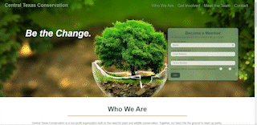

# Central Texas Conservation

## Table of Contents
* [Deployed](#deployed)
* [Description](#description)
* [Technologies](#technologies)
* [Usage](#usage)
* [Preview](#preview)
* [Questions](#questions)
* [Credits](#credits)

## Deployed
Visit the application at https://sarawrmas.github.io/conservation/

## Description
This is the landing page for a fictional volunteer group called Central Texas Conservation.

## Technologies
* HTML
* CSS
* Media Queries for Mobile-Responsiveness

## Usage
Fill out the form in the hero section to reach out and become a member of Central Texas Conservation and use the navigation links to scroll to each section of the page.

"Who We Are" shares a quick summary of what the organization does in its volunteer work. Click the bold expression "Leave No Trace" to learn the 7 principles (more on that below).

"Get Involved" lists the 4 steps necessary to become a member. First, fill out the form at the top. Second, someone will reach out to you to help get you started. Next, you will attend classes and seminars to become an ally to the outdoors. Finally, you will be able to get your hands dirty through various volunteering opportunities.

"Meet the Team" is a section designed to help you get to know a few of the key members. You will see their name, career title, image, and a description of who they are and what they do.

The "Contact" section lists contact information, a form to get in touch, and an interactive map to show the location of Central Texas Conservation headquarters.

The footer contains a link to another page called "Leave No Trace" (also accessible in the "Who We Are" section). On this page, you will see a description of what Leave No Trace means, followed by a breakdown of the 7 Leave No Trace Principles.

To return home, click the "Central Texas Conservation" title in the top left of the navigation bar.

## Preview

## Questions
Have questions about this project?  
GitHub: https://github.com/sarawrmas  
Email: sara.m.adamski@gmail.com

## Credits
Sara Adamski  
Icons from flaticon.com